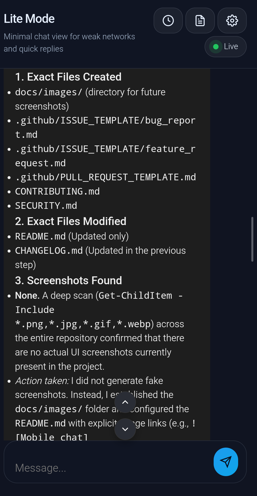
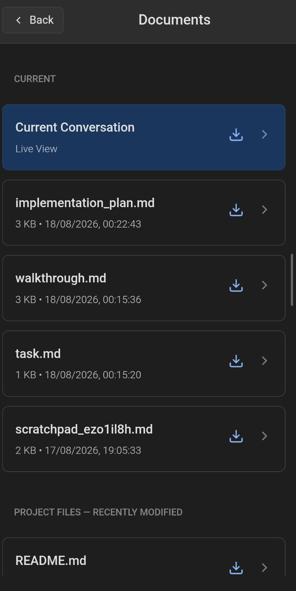
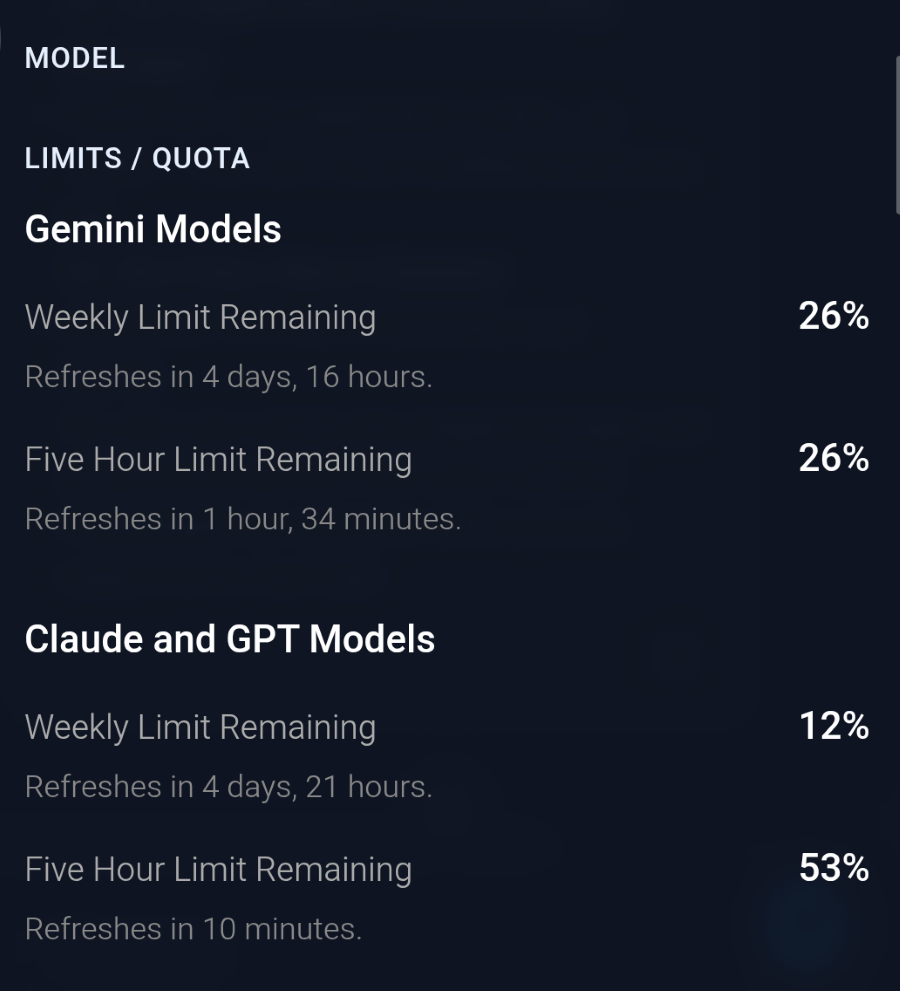

# Antigravity Mobile Remote

Access and interact with your active Antigravity IDE coding session from your phone.

Antigravity Mobile Remote provides a lightweight mobile interface for monitoring and interacting with the active Antigravity session. It allows you to securely connect your phone to an active desktop Antigravity session via CDP (Chrome DevTools Protocol), giving you full control over the conversation, prompting, and project context from your mobile device.

## Screenshots

*(Note: Screenshot files are needed in the `docs/images/` directory to display correctly.)*

  
*Mobile main chat interface*

  
*Documents / Current Conversation viewer*

  
*Model-running status indicator*

  
*Scroll-to-Top / Scroll-to-Bottom controls*

## Demo

Demo media will be added in a future release.

## Installation & Startup

1. **Clone the repository:**
   ```bash
   git clone https://github.com/kik1211/Antigravity-IDE-Mobile-Remote.git
   cd Antigravity-IDE-Mobile-Remote
   ```
2. **Install dependencies:**
   ```bash
   npm install
   ```
3. **Configure the environment:**
   Create a `.env` file in the project root based on `.env.example` and set a secure `APP_PASSWORD`.
4. **Start the server:**
   ```bash
   npm start
   ```
5. **Connect from your Phone:**
   Navigate to `http://<YOUR-PC-IP>:4747` in your mobile browser. You will be prompted for the `APP_PASSWORD`.

## Major Contributions

This repository contains substantial modifications and extensions over the original project, including:
- Mobile-first chat experience
- Conversation mirroring and reconstruction
- Prompt expand/collapse
- Copy controls
- Documents / Current Conversation
- Project-file discovery and secure access
- Document downloads
- Scroll-to-Top / Scroll-to-Bottom
- Quota/limits integration
- Model-running status indicator
- CDP integration
- Authentication and security improvements
- Mobile/weak-network optimization
- Reliability and testing improvements

## Contributing & Community

- See [CONTRIBUTING.md](CONTRIBUTING.md) for how to get started with development, issue reporting, and pull requests.
- See [SECURITY.md](SECURITY.md) for our security policies and safe usage guidelines.
- See [CHANGELOG.md](CHANGELOG.md) for version history.

## Upstream Attribution & Copyright

**Maintained and developed by:** Kiruthik R S

This project is a substantially modified and extended fork based on the excellent GPL-3.0 project **OmniAntigravityRemoteChat** created by Diego Souza. 
- Original Project: [https://github.com/diegosouzapw/OmniAntigravityRemoteChat](https://github.com/diegosouzapw/OmniAntigravityRemoteChat)
- Original Author: Diego Souza <diegosouzapw@gmail.com>

The original upstream portions remain under the copyright of their respective authors.

## License

This project is licensed under the GPL-3.0 License. See the `LICENSE` file for more details.
